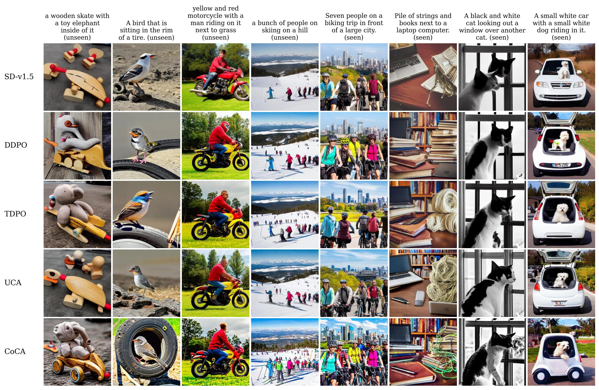
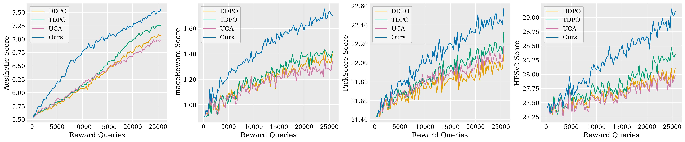

# CoCA

This is an official implementation of "Step-level Reward for Free in RL-based T2I Diffusion Model Fine-tuning". CoCA is a contribution-based credit assignment algorithm that transforms trajectory-level rewards into step-level rewards at no additional cost in RL fine-tuning of T2I diffusion models.



## Installation

```
cd CoCA
pip install -e .
```

## Training

We provide training scripts in the `bash/` directory for fine-tuning on Aesthetic, HPSv2, ImageReward, and PickScore.

Fine-tuning SD-v1.5 on Aesthetic score using CoCA.

```
bash bash/train_coca_aesthetic.sh
```

Fine-tuning SD-v1.5 on HPSv2 score using CoCA.

```
bash bash/train_coca_hps.sh
```

Fine-tuning SD-v1.5 on ImageReward score using CoCA.

```
bash bash/train_coca_ir.sh
```

Fine-tuning SD-v1.5 on PickScore using CoCA.

```
bash bash/train_coca_pick.sh
```

We also provide training scripts for running comparison experiments on DDPO and UCA (Uniform Credit Assignment) method.

Fine-tuning SD-v1.5 on Aesthetic score using DDPO.

```
bash bash/train_ddpo_aesthetic.sh
```

Fine-tuning SD-v1.5 on Aesthetic score using UCA.

```
bash bash/train_uca_aesthetic.sh
```

## Reward Curves


